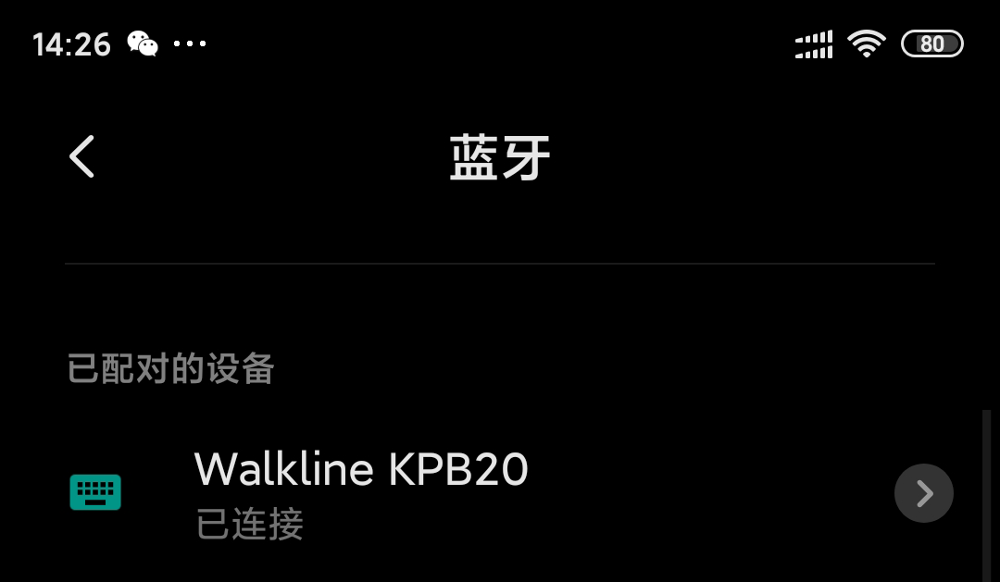

<h1 align="center">MicroPython Beacon Library</h1>
<p align="center"></p>

### 项目介绍

A MicroPython library providing APIs to interact with Beacons, for ESP32

### 相关知识

以个人理解介绍一些和`Beacon`相关的知识，尽量不误导

#### 蓝牙设备的角色定义

* Broadcaster Role (**Advertiser**)：蓝牙设备想要被其它设备发现并使用，第一步就是要作为`Advertiser`（广播员角色，广告商，基站等等）进行数据广播，将自己的名字、MAC 地址、包含的服务和外观等关键信息发布出去

* Observer Role (**Scanner**)：有`Advertiser`发送广播就要有`Scanner`进行观察扫描，得到对方的关键信息，比如：MAC 地址，RSSI 信号强度，可连接性，和广播信息等

* **Central** Role (GATT Client)：`Scanner`扫描并得到关键信息后，可以选择和`Advertiser`进行连接，此时`Scanner`就转变为中心设备（`Central`）

* **Peripheral** Role (GATT Server)：当`Central`选择进行连接后，`Advertiser`也就转变为外围设备（`Peripheral`），并终止数据广播

> 我们的`Beacon`设备为了做到不间断的数据广播，所以必须**不具备可连接性**，也就是只作为`Advertiser`角色使用

参考资料：

* [ubluetooth — low-level Bluetooth](http://docs.micropython.org/en/latest/library/ubluetooth.html)

#### 广播数据格式分析

`Advertiser`广播的数据，简单说就是若干组数据的组合，每组数据包含：

* 数据长度（Length）
* 数据类型（[AD_TYPE](https://gitee.com/walkline/micropython-beacon-library/blob/master/ble/const.py#L29)）
* 数据内容（Data）

> 每条广播内容的长度限制为 37 字节，去掉 6 字节的设备 MAC 地址，我们实际可以使用的最大长度为 31 字节

以 [ESP32 BLE](https://gitee.com/walkline/esp32-ble) 项目的`HID 设备`广播数据为例，它广播的数据为：

```python
bytearray(b'\x02\x01\x06\x03\x03\x0f\x18\x03\x03\x0a\x18\x03\x03\x12\x18\x03\x19\xc1\x03\x06\xff\x06\x00\x03\x00\x80')

# 拆分后得到 6 组数据
b'\x02\x01\x06'
b'\x03\x03\x0f\x18'
b'\x03\x03\x0a\x18'
b'\x03\x03\x12\x18'
b'\x03\x19\xc1\x03'
b'\x06\xff\x06\x00\x03\x00\x80'
```

根据数据格式分析后，得到如下内容：

| | Length | AD_TYPE | Data |
| :-: | :-: | :-: | :-: |
| 1 | `x02` | `x01` (FLAGS) | `x06` |
| 2 | `x03` | `x03` (16BIT_SERVICE_UUID) | `x0fx18` |
| 3 | `x03` | `x03` (16BIT_SERVICE_UUID) | `x0ax18` |
| 4 | `x03` | `x03` (16BIT_SERVICE_UUID) | `x12x18` |
| 5 | `x03` | `x19` (APPEARANCE) | `xc1x03` |
| 6 | `x06` | `xff` (MANUFACTURER_SPECIFIC_DATA) | `x06x00x03x00x80` |

逐一分析一下 4 个不同的`AD_TYPE`：

* `x01`：数据`x06`转换二进制为`0b00000110`，根据下表即可得到`x06`代表设备模式为：`LE General Disconverable Mode`和`BR/EDR Not Supported`

	| 位数 | 数值 | 描述 |
	|:-:|:-:| :-: |
	| 1 | 0 | LE Limited Discoverable Mode |
	| 2 | 1 | LE General Disconverable Mode |
	| 3 | 1 | BR/EDR Not Supported |
	| 4 | 0 | LE and BR/ERD Capable (Controller) |
	| 5 | 0 | LE and BR/ERD Capable (Host) |
	| 6 | 0 | Reserved |
	| 7 | 0 | Reserved |
	| 8 | 0 | Reserved |

* `x03`：数据`x0fx18`为[大端模式](https://www.baidu.com/s?ie=UTF-8&wd=%E5%A4%A7%E5%B0%8F%E7%AB%AF)表示的`Service UUID`，即`0x180f`，从 [GATT Services | Bluetooth® Technology Website](https://www.bluetooth.com/specifications/gatt/services/) 页面查询可知`0x180f`为`Battery Service`，其余两个分别为`Device Information`和`Human Interface Device`

* `x19`：数据`xc1x03`也是`大端模式`表示，转换十进制为`961`，[查询](https://gitee.com/walkline/micropython-beacon-library/blob/master/ble/const.py#L89)可知设备的`Appearance`为`Keyboard`，即图中左侧的图标

	

* `xff`：数据`x06x00x03x00x80`可拆分为：
	* `x06x00`：`大端模式`表示的公司标识符，从 [Company Identifiers | Bluetooth® Technology Website](https://www.bluetooth.com/specifications/assigned-numbers/company-identifiers/) 页面查询可知`0x0006`为`Microsoft`
	* `x03`：代表微软的`Swift Pair Beacon`技术
	* `x00`：代表应用场景为`Pairing over Bluetooth LE only`
	* `x80`：代表已保留的发射功率值

	> `xff`代表的`AD_TYPE`根据不同的制造商设置不同的参数数据

最终总结：

```python
bytearray(b'\x02\x01\x06\x03\x03\x0f\x18\x03\x03\x0a\x18\x03\x03\x12\x18\x03\x19\xc1\x03\x06\xff\x06\x00\x03\x00\x80')
```

`Scanner`扫描到这条广播内容后分析得出，这个即将成为`Peripheral`的设备`支持通用发现模式`且`不支持 BR/EDR`，它的外观图标为`键盘`，包含了`Battery Service`、`Device Information`和`Human Interface Device`这 3 个服务（这是作为 HID 设备的必要服务），并且它还支持`微软`的`Swift Pair Beacon`技术

#### 需要广播的内容太多，31 字节不够用怎么办？

首先把我们必须要广播的数据准备好，再准备一个`Scan Response`数据然后进行广播，在`Scanner`扫描的时候同时会读取`Scan Response`的数据，整合两部分数据再进行内容分析，我们以此达到广播超过 31 字节内容的目的

> `Scan Response`实际不会进行广播，它只是在响应`Scanner`扫描的时候才会进行传递

参考资料：

* [BLE.gap_advertise()](http://docs.micropython.org/en/latest/library/ubluetooth.html#ubluetooth.BLE.gap_advertise)
* [advertising_resp_payload()](https://gitee.com/walkline/micropython-beacon-library/blob/master/ble/tools.py#L147)

#### 如何计算 tx_power

谷歌官方称为`tx_power`，苹果官方称为`Measured Power`，是根据设备自身性能统计得到的发射功率平均值，根据设备到设备之间的功率值计算相对距离，根据文档介绍，当相对距离大于`1 米`时得到的数值并不可靠，所以只需给出 4 种状态（`Proximity State`）即可：

| 状态 | 简单描述 |
| :-: | :- |
| Immediate | 非常接近，甚至是叠放状态 |
| Near | 1 到 3 米之内 |
| Far | 仅可以接收到广播，但不稳定 |
| Unknown| 无法确定距离 |

苹果官方给出的确定设备发射功率的方法如下：

* 至少使用`iPhone 5s`
* 从`Apple Store`下载`Air Locate`
* 去掉手机保护壳，垂直方向握住手机并保证上半部分未被遮挡
* 当 `Beacon 设备`开始广播后，站在 **1 米** 距离，重复采样`RSSI 数值`**至少 10 秒**
* 采样结果`降序`排序，去掉 10% 最高值和 20% 最低值
* 将剩余采样结果求平均值，得到发射功率

参考资料：

* [Getting Started with iBeacon.pdf](https://developer.apple.com/ibeacon/Getting-Started-with-iBeacon.pdf)
* [Artwork and Specifications](https://developer.apple.com/ibeacon/)
